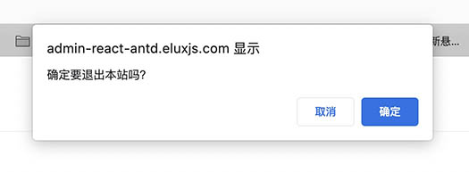
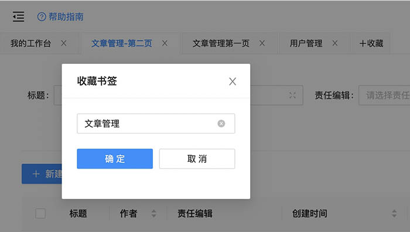
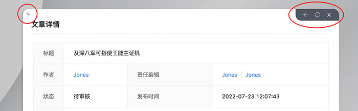
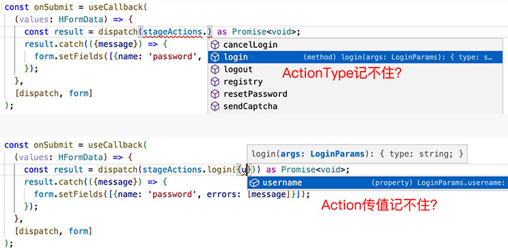
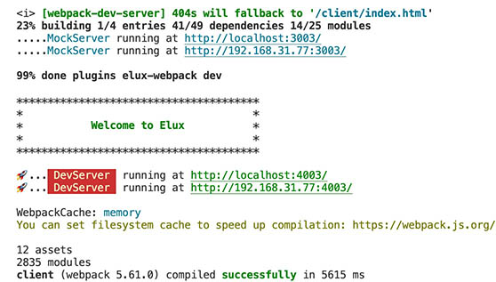

<div align="center">
    
    <h2><a href="https://eluxjs.com">eluxjs.com</a></h2>
    <h3>基于“微模块”和“模型驱动”的跨平台、跨框架『同构方案』</h3>
    <small>支持React/Vue/Web(浏览器)/Micro(微前端)/SSR(服务器渲染)/MP(小程序)/APP(手机应用)</small>
</div>

## 项目介绍

本项目主要基于`Elux+Antd`构建，包含`React`版本和`Vue`版本，旨在提供给大家一个**简单基础**、**开箱即用**的后台管理系统通用模版，主要包含运行环境、脚手架、代码风格、基本Layout、状态管理、路由管理、增删改查逻辑、列表、表单等。

> 为保持工程简单清爽，方便二次开发，不提供各种纷杂的具体业务组件，请视具体业务自行加入（网上很多）

## 在线预览

<http://admin-react-antd.eluxjs.com/>

## Git仓库

- React版本
  - github: <https://github.com/hiisea/elux-react-antd-admin>
  - gitee: <https://gitee.com/hiisea/elux-react-antd-admin-fork>
- Vue版本
  - github: <https://github.com/hiisea/elux-vue-antd-admin>
  - gitee: <https://gitee.com/hiisea/elux-vue-antd-admin-fork>

## 安装方法

- 使用Git命令clone相应的库：`git clone xxx`
- 也可以使用Elux提供的命令：`npm create elux@latest 或 yarn create elux`

## ⚠️注意事项

安装请注意！安装请注意！安装请注意！重要的事情说三遍，因为使用了`workspace`，所以请保证你的安装环境：

- Node版本 >= 14.0.0
- 推荐使用 `yarn` 安装依赖
- 如果使用 `npm` 安装依赖，npm版本 >= 7.0

## 你看得见的UI

- 🚀 提供通用的Admin系统Layout（包括注册、登录、忘记密码等）。
- 🚀 动态获取Menu菜单、轮询最新消息等。
- 🚀 支持第一次后退溢出，自动回到首页，再次后退则弹出提示：您确定要离开本站？防止用户误操作。
- 提供&lt;DocumentHead&gt;组件，方便在SinglePage中维护document title、keyword、description等，该组件也可用于SSR，例如：

  ```ts
  <DocumentHead title={(id?'修改':'新增')+'用户'} />
  ```

- 🚀 提供配置式查询表单, 还带TS类型验证哦，再也不担心写错字段名：

  ```ts
  const formItems: SearchFromItems<ListSearchFormData> = [
    {name: 'name', label: '用户名', formItem: <Input placeholder="请输入关键字" />},
    {name: 'nickname', label: '呢称', formItem: <Input placeholder="请输入呢称" />},
    {name: 'status', label: '状态', formItem: <Select placeholder="请选择用户状态" />},
    {name: 'role', label: '角色', formItem: <Select placeholder="请选择用户状态" />},
    {name: 'email', label: 'Email', formItem: <Input placeholder="请输入Email" />},
  ];
  ```

- 🚀 提供展开与隐藏高级搜索：[展开高级](http://admin-react-antd.eluxjs.com/admin/member/list/maintain?email=u.mese%40jww.gh) / [隐藏高级](http://admin-react-antd.eluxjs.com/admin/member/list/maintain)
- 🚀 提供跨页选取、重新搜索后选取、review已选取：[跨页选取](http://admin-react-antd.eluxjs.com/admin/member/list/maintain)
- 🚀 提供配置式批量操作等功能，如：[批量操作](http://admin-react-antd.eluxjs.com/admin/member/list/maintain)

  ```ts
  const batchActions = {
      actions: [
        {key: 'delete', label: '批量删除', confirm: true},
        {key: 'resolved', label: '批量通过', confirm: true},
        {key: 'rejected', label: '批量拒绝', confirm: true},
      ],
      handler: (item: {key: string}, ids: (string | number)[]) => {
        if (item.key === 'delete') {
          deleteItems(ids as string[]);
        } else if (item.key === 'resolved') {
          alterItems(ids as string[], {status: Status.审核通过});
        } else if (item.key === 'rejected') {
          alterItems(ids as string[], {status: Status.审核拒绝});
        }
      },
    };
  ```

- 🚀 提供资源选择器，并封装成select，可单选、多选、选满自动提交，如：[创建文章时，查询并选择责任编辑](http://admin-react-antd.eluxjs.com/admin/article/item/edit?__c=_dialog)

  ```jsx
  <FormItem {...fromDecorators.editors}>
    <MSelect<MemberListSearch>
      placeholder="请选择责任编辑"
      selectorPathname="/admin/member/list/selector"
      fixedSearch={{role: Role.责任编辑, status: Status.启用}}
      limit={[1, 2]}
      returnArray
      showSearch
    ></MSelect>
  </FormItem>
  ```

- 🚀 提供收藏夹书签功能，用其代替Page选项卡，操作更灵活。点击左上角[【+收藏】](http://admin-react-antd.eluxjs.com/admin/member/list/maintain)试试... 
- 🚀 提供页内刷新功能。点击右上角[【刷新按钮】](http://admin-react-antd.eluxjs.com/admin/member/list/maintain)试试...
- 🚀 虚拟Window
  - 路由跳转时可以在新的虚拟窗口中打开，类似于target='_blank'，但是虚拟Window哦，如：[新窗口打开](http://admin-react-antd.eluxjs.com/admin/article/list/index?author=48&__c=_dialog) / [本窗口打开](http://admin-react-antd.eluxjs.com/admin/article/list/index?author=48)
  - 窗口中可以再开新窗口，最多可达10级
  - 弹窗再弹弹窗体验不好？多层弹窗时自动隐藏下层弹窗，关闭上层弹窗自动恢复下层弹窗，保证每一时刻始终之会出现一层弹窗
  - 实现真正意义上的Window（非简单的Dialog），每个窗口不仅拥有独立的Dom、状态管理Store、还自动维护独立的`历史记录栈`
  - 提供窗口工具条：后退、刷新、关闭，如：[文章列表](http://admin-react-antd.eluxjs.com/admin/article/list/index?author=48&__c=_dialog) => 点击标题 => 点击作者 => 点击文章数。然后你可以依次回退每一步操作，也可一次性全部关闭。
  - 提供窗口最大化、最小化按钮，如：[文章详情，窗口左上角按钮](http://admin-react-antd.eluxjs.com/admin/article/item/detail/50?__c=_dialog)；并支持默认最大化，如：[创建文章](http://admin-react-antd.eluxjs.com/admin/article/item/edit?__c=_dialog) 
  - 窗口可以通过Url发送，如将`http://admin-react-antd.eluxjs.com/admin/member/item/edit/50?__c=_dialog`发送给好友后，其可以通过Url还原窗口。
  - 轻松实现keep-alive。keep-alive优点是用户体验好，缺点是太占资源（需要缓存所有Dom元素还有相关内存变量），现在使用虚拟Windw，你想keep-alive就在新窗口中打开，不想keep-alive就在原窗口中打开，关闭窗口就自动销毁keep-alive
  
- 🚀 基于抽象的增删改查逻辑：
  - 业务逻辑通过类的继承复用，如果是标准的增删改查基本上不用写代码，否则可以自己覆盖父类中的某些方法：

  ```ts
  export class Model extends BaseResource<MemberResource> {
    protected api = api;
    protected defaultListSearch = defaultListSearch;
  }
  ```

  - UI逻辑通过`Hooks`复用。
  - 将视图抽象成为2大类：*列表*(List)和*单条*(Item)，抽取其共性。
  - 在此基础上引入视图`渲染器(Render)`概念，类别名+渲染器=具体某个业务视图，如：
    - type=list,render=maintain(列表+维护)，如：[/admin/member/list/maintain](http://admin-react-antd.eluxjs.com/admin/member/list/maintain)
    - type=list,render=index(列表+展示)，如：[/admin/article/list/index](http://admin-react-antd.eluxjs.com/admin/article/list/index?author=49&__c=_dialog)
    - type=list,render=selector(列表+选择)，如：[/admin/member/list/selector](http://admin-react-antd.eluxjs.com/admin/member/list/selector?role=editor&status=enable&__c=_dialog)
    - type=item,render=detail(单条+展示)，如：[/admin/member/item/detail/49](http://admin-react-antd.eluxjs.com/admin/member/item/detail/49?__c=_dialog)
    - type=item,render=edit(单条+编辑)，如：[/admin/member/item/edit/49](http://admin-react-antd.eluxjs.com/admin/member/item/edit/49?__c=_dialog)

## 你看不见的幕后

- 🚀 使用微模块架构，将业务功能封装成独立微模块，想要哪个功能就安装哪个模块，是一种粒度更细的微前端

  ```txt
   你以前的SRC长这样？？？
    │
    ├─ src
    │  ├─ api                 # API接口管理
    │  ├─ assets              # 静态资源文件
    │  ├─ components          # 全局组件
    │  ├─ config              # 全局配置项
    │  ├─ directives          # 全局指令文件
    │  ├─ enums               # 项目枚举
    │  ├─ hooks               # 常用 Hooks
    │  ├─ language            # 语言国际化
    │  ├─ layout              # 框架布局
    │  ├─ routers             # 路由管理
    │  ├─ store               # store
    │  ├─ styles              # 全局样式
    │  ├─ typings             # 全局 ts 声明
    │  ├─ utils               # 工具库
    │  ├─ views               # 项目所有页面
    │  ├─ App.vue             # 入口页面
    │  └─ main.ts             # 入口文件
  ```

   快来拯救你的SRC🔥，

  ```txt
  使用微模块后SRC长这样！！！
    │
    ├─ src
    │  ├─ moddules            # 各业务微模块
    │  │    ├─ user
    │  │    ├─ article        
    │  │    ├─ comment   
    │  ├─ Project.vue         # 各微模块聚合配置
    │  └─ index.ts            # 入口文件
  ```

  - 微模块支持同步/异步加载
  - 微模块支持本地目录、支持发布成NPM包，支持独立部署（微前端）
  - 微模块支持整体TS类型验证与提示
  
- 🚀 内置最强状态管理框架(^-^)：
  - 同时支持React/Vue，不再深度耦合UI框架。
  - 最大程度简化action和store的写法

  ```ts
  export class Model extends BaseMode {

    @reducer //类似Vuex的mutations
    public putCurUser(curUser: CurUser) {
      this.state.curUser = curUser; // vue中可直接修改
      //this.state = {...this.state, curUser} react中
    }

    @effect() //类似Vuex的action
    public async login(args: LoginParams) {
      const curUser = await api.login(args);
      this.dispatch(this.actions.putCurUser(curUser));
      this.getRouter().relaunch({url: AdminHomeUrl}, 'window');
    }
  }
  ```

  - 与路由结合，支持Store多实例。
  - 路由跳转时自动清空Store，再也不用担心State在Store中无限累积。
  - 为action引入线程机制，支持在处理action的过程中，在派生出新的action线程。
  - action执行中支持异步操作：

  ```ts
  @effect()
  public async updateItem(id: string, data: UpdateItem) {
    await this.api.updateItem!({id, data}); //调用后台API
    await this.getRouter().back(1, 'window'); //路由后退一步(到列表页)
    message.success('编辑成功！'); //提示
    this.getRouter().back(0, 'page'); //back(0)表示刷新当前页(列表页)
  }
  ```

  - 支持awiat action的执行结果，如在UI中等待login这个action的执行结果：

  ```ts
  const onSubmit = (values: HFormData) => {
    const result = dispatch(stageActions.login(values));
    //stageActions.login()中包含异步请求，返回Promise

    result.catch(({message}) => {
      //如果出错(密码错误)，在form中展示出错信息
      form.setFields([{name: 'password', errors: [message]}]);
    });
  };
  ```

  - 为action引入事件机制，dispatch一个action支持多处监听，共同协作完成一个长流程业务。例如：ModelA 和 ModelB 都想监听`用户切换`这个Action：

  ```ts
  // ModelA:
  export class ModelA extends BaseResource {
    @effect()
    public async ['stage.putCurUser'](user: User) {
      if (user.hasLogin) {
          this.dispath(this.actions.xxx());
      } else {
          this.dispath(this.actions.xxx());
      }
    }
  }

  // ModelB:
  export class ModelB extends BaseResource{
    @effect()
    public async ['stage.putCurUser'](user: User) {
      if (user.hasLogin) {
          this.dispath(this.actions.xxx());
      } else {
          this.dispath(this.actions.xxx());
      }
    }
  }
  ```

  - 路由跳转前会自动派发`stage._testRouteChange`的action，你可以监听它，阻止路由跳转：

  ```ts
  @effect(null)
  protected async ['this._testRouteChange']({url, pathname}) {
      if (!this.state.curUser.hasLogin && this.checkNeedsLogin(pathname)) {
          throw new CustomError(CommonErrorCode.unauthorized, '请登录！');
      }
  }
  ```

  - 支持catch action执行过程中的错误，并决定继续或终止当前action执行：

  ```ts
  @effect(null)
  protected async ['this._error'](error: CustomError) {
      if (error.code === CommonErrorCode.unauthorized) {
          this.getRouter().push({url: '/login'}, 'window');
      }else{
          alert(error.message);
      }
      throw error;
  }
  ```

  - 最方便的注入loading状态，想要跟踪异步action的执行情况？只需要在声明方法中传人key名就行了，如：

    ```ts
    @effect('this.listLoading') //将该异步action的执行状态注入this.state.listLoading中
    public async fetchList(listSearchData?: TDefineResource['ListSearch']) {
      const listSearch = listSearchData || this.state.listSearch || this.defaultListSearch;
      const {list, listSummary} = await this.api.getList!(listSearch);
      this.dispatch(this.privateActions.putList(listSearch, list, listSummary));
    }
    ```

  - 武装到牙齿的Typescript智能提示和自动补全（并且类型自动生成，无需手写）：
  
- 🚀 提供基于双栈单链的虚拟路由。
  - 拥有2维历史记录栈，将原生路由体验带入浏览器。

  ```ts
  router.push({url: '/login'}, 'page') //在当前页历史记录栈中新增一条历史记录
  router.push({url: '/login'}, 'window') //在新窗口历史记录栈中新增一条历史记录
  ```

  - 基于虚拟路由，不再直接关联原生路由，中间可以转换映射。如在小程序中映射：

  ```ts
  const NativePathnameMapping = {
    in(nativePathname) { //将小程序路由地址映射为虚拟路由地址
      if (nativePathname === '/') {
        nativePathname = '/modules/article/pages/list';
      }
      const Prefix = {my: '/admin'};
      return nativePathname.replace(/^\/modules\/(\w+)\/pages\//, (match, moduleName) => {
        return (Prefix[moduleName] || '')+'/'+moduleName+'/';
      });
    },
    out(internalPathname) { //将虚拟路由地址映射为小程序路由地址
      internalPathname = internalPathname.replace('/admin/', '/');
      return internalPathname.replace(/^\/(\w+)\//, '/modules/$1/pages/');
    },
  }
  ```

  - 跨平台，可用于浏览器、服务器SSR、小程序、原生应用。
  - 跨框架，可用于React、Vue，不依赖其它路由框架，如react-router、vue-router
  - 可完整保存历史快照，包括Store和Dom元素
  - 可访问和查找历史记录，不再只是一个history.length

  ```ts
  const length = router.getHistoryLength(); //获取历史栈中的记录数
  const list = router.getHistory(); //获取所有历史记录
  const record = router.findRecordByStep(10); //获取10步之前的历史记录
  const record2 = router.findRecordByKey('8_1'); //获取编号为8_1的历史记录
  ```

    例如登录窗口中点击“取消登录”你需要回退到前一个页面，但此时如果前一个页面就是需要登录的页面，那么登录窗口又会被重新弹出。所以点击“取消登录”应当回退到最近的不需要登录的页面：

  ```ts
  @effect()
  public async cancelLogin(): Promise<void> {
    //在历史栈中找到第一条不需要登录的记录
    //如果简单的back(1)，前一个页面需要登录时会引起循环
    this.getRouter().back((record) => {
      return !this.checkNeedsLogin(record.location.pathname);
    }, 'window');
  }
  ```

  - 支持路由拦截和路由守卫
  - 支持后退溢出时重定向，比如防止用户后退过多，不小心退出了本站：

  ```ts
  @effect(null)
  protected async ['this._error'](error: CustomError): Promise<void> {
    if (error.code === ErrorCodes.ROUTE_BACK_OVERFLOW) {
      const redirect: string = HomeUrl;
      //如果已经时主页，则提示用户是否退出本站？
      if (this.getRouter().location.url === redirect && window.confirm('确定要退出本站吗？')){
        //注意: back('')可以退出本站
        setTimeout(() => this.getRouter().back('', 'window'), 0);
      } else {
        //如果不是在主页，则先回到主页
        setTimeout(() => this.getRouter().relaunch({url: redirect}, 'window'), 0);
      }
    };
  }
  ```

  - 可跟踪和等待路由跳转完成。例如修改用户后，需要返回列表页面并刷新：

  ```ts
  @effect()
  public async updateItem(id: string, data: UpdateItem) {
    await this.api.updateItem!({id, data});
    await this.getRouter().back(1, 'window'); //可await路由后退
    message.success('编辑成功！');
    this.getRouter().back(0, 'page'); //back(0)可刷新页面
  }
  ```

  - 提供更多路由跳转方法

  ```ts
  router.push(location, target); //新增
  router.replace(location, target); //替换
  router.relaunch(location, target); //重置
  router.back(stepOrCallback, target) //后退或刷新
  ```

- 🚀 提供与项目同构的本地MockServer，MockServer也使用Typescript，但无需再写类型文件，直接从`src/`下面与项目共享，支持修改自动重启。
- 🚀 开箱即用的脚手架。提供封装好的`Cli命令行`脚手架，不用自己折腾：
- 🚀 基本的`eslint/stylelint/babel`都已经帮你打包好了，不用安装各种插件和写一大堆依赖：

  ```json
  "devDependencies": {
    "@elux/babel-preset": "^1.0.2",
    "@elux/eslint-plugin": "^1.2.2",
    "@elux/stylelint-config": "^1.1.1"
  }
  ```

- 🚀 未完待续...

## 不使用NPM管理微模块

项目中的`微模块`默认是使用NPM包来管理的，每个微模块下都有一个`package.json`文件，例如：`src/modules/admin/package.json`，开发时使用了`workspace`和`monorepo`来管理：

```json
  "workspaces": [
    "./mock",
    "./public",
    "./src/modules/*"
  ],
```

跨`微模块`引用时，用的是npm包名，例如：

```ts
import {ListSearch} from '@elux-admin-antd/member/entity';
```

`微模块`最大的好处还是在于**高内聚，低耦合**，至于是否要用npm来管理，不是必须的。如果你不想绕这么一个圈，也可以分分钟改成普通的单体结构：

```ts
import {ListSearch} from '@/modules/member/entity';
```

只需要在`src/tsconfig.json`中加入paths别名就可以了：

```json
"paths": {
  "@/*": ["./*"]
}
```

## Vue版特别说明

Vue版/React版保持同步，由于[Elux](https://eluxjs.com)践行“**模型驱动**”的架构理念，View被刻意写得很薄，很多逻辑写在了Model中（因为Model与UI框架无关、Vue和React都可以复用）。

所以需要重构的只是View，由于Vue3中可以使用`steup+tsx`，并且`antd-vue`与`antd-react`风格和api基本保持一致，所以能2个版本的差异就更小了。Vue版全程使用tsx编写，你也可以自己改成template方式，脚手架已经内置了对.vue文件的支持。也欢迎有志之士贡献源码，将其重构为`template版`，新增一个branch或fork。

## 更多相关文章

- [从"微前端"到“微模块”](https://juejin.cn/post/7106791733509226533)
- [不想当Window的Dialog不是一个好Modal，弹窗翻身记...](https://juejin.cn/post/7124177821953425422)
- [手撸Router，还要啥Router框架？让react-router/vue-router躺一边凉快去](https://juejin.cn/post/7124959667326812196)

## 感谢关注，欢迎参与

 [eluxjs.com](https://eluxjs.com) | [掘金专栏](https://juejin.cn/column/7106899933537501221) | QQ/微信交流群


开源项目，欢迎参与贡献源码(^V^)！觉得好用别忘了[Github](https://github.com/hiisea/elux-react-antd-admin)给个Star哦(-_-)...
